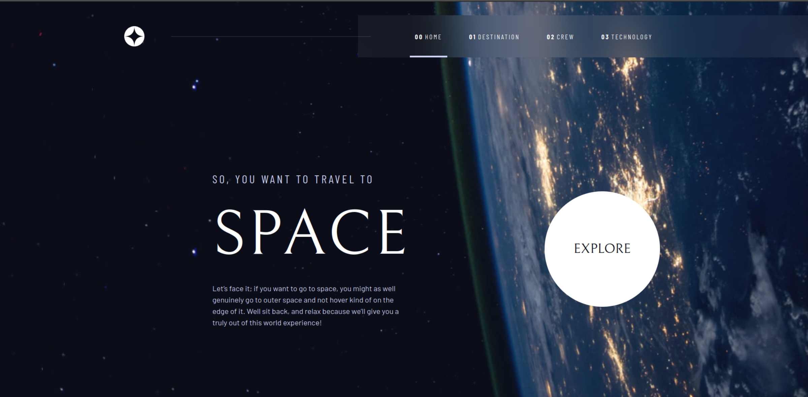

# Frontend Mentor - Space tourism website solution

This is a solution to the [Space tourism website challenge on Frontend Mentor](https://www.frontendmentor.io/challenges/space-tourism-multipage-website-gRWj1URZ3). Frontend Mentor challenges help you improve your coding skills by building realistic projects.

## Table of contents

- [Overview](#overview)
    - [The challenge](#the-challenge)
    - [Screenshot](#screenshot)
    - [Links](#links)
- [My process](#my-process)
    - [Built with](#built-with)
    - [What I learned](#what-i-learned)
    - [Continued development](#continued-development)
    - [Useful resources](#useful-resources)
- [Author](#author)

## Overview

### The challenge

Users should be able to:

- View the optimal layout for each of the website's pages depending on their device's screen size
- See hover states for all interactive elements on the page
- View each page and be able to toggle between the tabs to see new information

### Screenshot

### Links

- Solution URL: [My Solution](https://www.frontendmentor.io/solutions/space-tourism-with-threejs-and-astro-0yiJPY38VO)
- Live Site URL: [Live Site URL](https://space-tourism-astro-threejs.vercel.app)

## My process

### Built with

- [Astro](https://astro.build/)
- [Vue](https://v3.vuejs.org/)
- [Tailwind CSS](https://tailwindcss.com/)
- [TresJS](https://tres.js.org/)
- [ThreeJS](https://threejs.org/)

### What I learned
I tried to push myself, and learn things that I never used before, like ThreeJS. I learned a lot about Astro :
- `viewTransition` is a great feature, that allows you to create a transition between pages, and it's very easy to use.
- `Data collection`, and how to use it in the components.
- `Astro Island`, and how to use it to create a website with multiple pages.

I ended up using TresJS to create the 3D models, and animations. It was a great experience, and I learned a lot about it.

### Continued development

I want to continue learning about ThreeJS, and how to create more complex 3D models, and animations.
Pushing myself to learn more in depth about Astro, this framework is amazing, and I want to use it more in the future.
### Useful resources

- [Astro Docs](https://docs.astro.build) - This helped me to understand how to use Astro.
- [ThreeJS Docs](https://threejs.org/docs/) - This is an amazing documentation, and it helped me to understand how to use ThreeJS.
- [TresJS Docs](https://docs.tresjs.org/) - This is an amazing documentation, and it helped me to understand how to use TresJS.
## Author

- Website - [Vincent Bouton](https://vbdevpro.com)
- Frontend Mentor - [@Vincent-Bouton](https://www.frontendmentor.io/profile/Vincent-Bouton)

